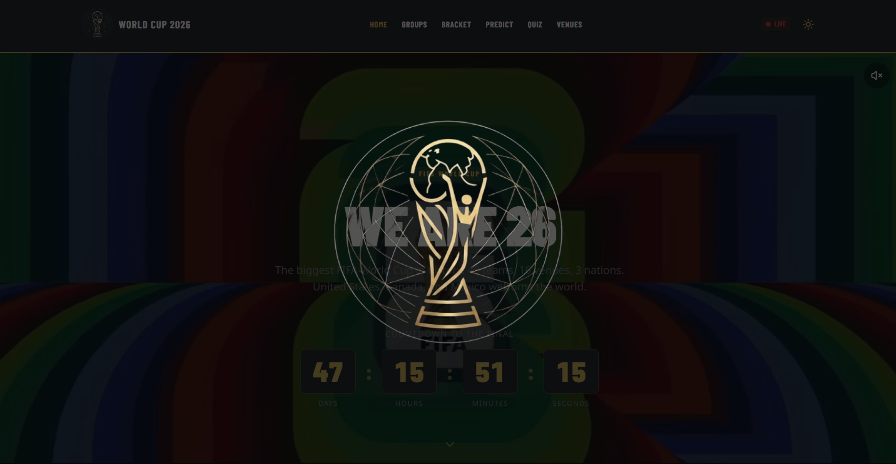

# 🏆 FIFA World Cup 2026 Fan Hub



> A modern, feature-rich web application for the FIFA World Cup 2026, built with Next.js 16, React 19, and Tailwind CSS.

---

## ✨ Features

### 🏠 Home Page
- **Hero Section** with stunning video background and countdown timer to the final
- **Interactive 3D Globe** showcasing all 16 venues across 3 host nations
- **Live Match Cards** displaying real-time match updates
- **Star Players** section featuring top World Cup players with photos
- **Animated Statistics** showing tournament key numbers

### 📊 Tournament Views
- **Bracket View** - Interactive tournament bracket visualization
- **Groups View** - Complete group stage standings and team information
- **Venues View** - Detailed information about all 16 stadiums
- **Match Center** - Comprehensive match listings with live updates

### 🎮 Interactive Features
- **Prediction System** - Make predictions for tournament outcomes
- **Quiz Section** - Test your World Cup knowledge
- **Player Profiles** - Detailed player information with photos from Wikipedia

### 🎨 Design & UX
- **Dark Theme** with gold accents inspired by World Cup branding
- **Responsive Design** - Optimized for mobile, tablet, and desktop
- **Smooth Animations** - Powered by Framer Motion
- **Modern UI Components** - Built with shadcn/ui and Radix UI
- **Custom Fonts** - Barlow Condensed for headings, clean sans-serif for body

---

## 🛠️ Tech Stack

### Frontend Framework
- **Next.js 16.2.6** - React framework with App Router
- **React 19** - Latest React version
- **TypeScript 5.7.3** - Type-safe development

### Styling
- **Tailwind CSS 4.2.0** - Utility-first CSS framework
- **PostCSS 8.5** - CSS transformation
- **CSS Modules** - Component-scoped styling

### UI Components
- **shadcn/ui** - Beautiful, accessible component library
- **Radix UI** - Unstyled, accessible UI primitives
- **Lucide React** - Icon library
- **Framer Motion 12.40.0** - Animation library

### Data Visualization
- **react-globe.gl 2.38.0** - 3D globe visualization
- **Recharts 2.15.0** - Chart library
- **Embla Carousel 8.6.0** - Carousel component

### Form Handling
- **react-hook-form 7.54.1** - Form state management
- **zod 3.24.1** - Schema validation
- **@hookform/resolvers 3.9.1** - Form validation integration

### Utilities
- **date-fns 4.1.0** - Date manipulation
- **clsx 2.1.1** - Conditional className utility
- **tailwind-merge 3.3.1** - Tailwind class merging
- **class-variance-authority 0.7.1** - Component variant management

### Analytics
- **@vercel/analytics 1.6.1** - Web analytics

---

## 📦 Installation

### Prerequisites
- Node.js 22+ 
- pnpm (recommended) or npm/yarn

### Clone the Repository
```bash
git clone <repository-url>
cd worldcup
```

### Install Dependencies
```bash
pnpm install
# or
npm install
# or
yarn install
```

### Environment Variables
Create a `.env` file in the root directory:
```env
# Add any environment variables here
# Currently no required environment variables for basic functionality
```

---

## 🚀 Usage

### Development Server
```bash
pnpm dev
# or
npm run dev
# or
yarn dev
```

Open [http://localhost:3000](http://localhost:3000) in your browser to see the application.

### Production Build
```bash
pnpm build
# or
npm run build
# or
yarn build
```

### Start Production Server
```bash
pnpm start
# or
npm start
# or
yarn start
```

### Linting
```bash
pnpm lint
# or
npm run lint
# or
yarn lint
```

---

## 📁 Project Structure

```
worldcup/
├── app/                      # Next.js App Router pages
│   ├── api/                  # API routes
│   │   ├── flags/           # Flag data endpoints
│   │   ├── games/           # Match data endpoints
│   │   └── groups/          # Group standings endpoints
│   ├── bracket/             # Bracket page
│   ├── groups/              # Groups page
│   ├── predict/             # Prediction page
│   ├── globals.css          # Global styles
│   ├── layout.tsx           # Root layout
│   └── page.tsx             # Home page
├── components/              # React components
│   ├── ui/                  # shadcn/ui components
│   ├── animated-number.tsx  # Animated number component
│   ├── countdown-block.tsx  # Countdown timer
│   ├── match-card.tsx       # Match card component
│   ├── navbar.tsx           # Navigation bar
│   └── ...                  # Other components
├── hooks/                   # Custom React hooks
│   ├── use-mobile.ts        # Mobile detection hook
│   └── use-toast.ts         # Toast notification hook
├── lib/                     # Utility libraries
│   ├── api.ts               # API client functions
│   ├── data.ts              # Static data
│   ├── types.ts             # TypeScript types
│   ├── utils.ts             # Utility functions
│   ├── player-photos.ts     # Player photo fetcher
│   └── data/                # Data files
│       └── wc2026-players.json  # Player data
├── public/                  # Static assets
│   ├── fonts/               # Custom fonts
│   ├── img/                 # Images
│   │   ├── coverwebsitebaru.png
│   │   ├── logoworldcuphitam.webp
│   │   └── logoworldcupputih.webp
│   └── video/               # Video files
│       └── worldcupintro.mp4
├── styles/                  # Additional styles
│   └── globals.css
├── .env                     # Environment variables
├── .gitignore              # Git ignore rules
├── components.json         # shadcn/ui configuration
├── next.config.mjs         # Next.js configuration
├── package.json            # Project dependencies
├── pnpm-lock.yaml          # pnpm lock file
├── postcss.config.mjs      # PostCSS configuration
├── tailwind.config.ts      # Tailwind CSS configuration
└── tsconfig.json           # TypeScript configuration
```

---

## 🔌 API Integration

The application integrates with external APIs for real-time data:

- **Matches API** - Fetches live match data, scores, and match details
- **Teams API** - Retrieves team information and flag URLs
- **Stadiums API** - Gets stadium information for venues
- **Groups API** - Fetches group standings and team positions

All API calls are handled through the `/api` routes in the Next.js App Router.

---

## 🎨 Customization

### Theme Colors
The application uses a custom color scheme defined in `tailwind.config.ts`:
- **wc-gold** - Gold accent color (#D4AF37)
- **wc-dark** - Dark background color
- **wc-light** - Light text color

### Fonts
- **Barlow Condensed** - Headings and display text
- **Inter** - Body text and UI elements

### Components
All UI components are built using shadcn/ui and can be customized in the `components/ui/` directory.

---

## 📝 Key Components

### MatchCard
Displays match information with team flags, scores, venue, and live status.

### PlayerCard
Shows player profiles with photos, team information, and statistics.

### WorldGlobe
Interactive 3D globe visualization using react-globe.gl to display tournament venues.

### CountdownBlock
Animated countdown timer to the World Cup final.

---

## 🤝 Contributing

Contributions are welcome! Please feel free to submit a Pull Request.

1. Fork the repository
2. Create your feature branch (`git checkout -b feature/AmazingFeature`)
3. Commit your changes (`git commit -m 'Add some AmazingFeature'`)
4. Push to the branch (`git push origin feature/AmazingFeature`)
5. Open a Pull Request

---

## 📄 License

This project is fan-made and not affiliated with FIFA. All World Cup trademarks and logos are property of FIFA.

---

## 👨‍💻 Author

**Hilmi Farrel Firjatullah**

- Fan-made World Cup 2026 Hub
- Created with ❤️ for football fans worldwide

---

## 🙏 Acknowledgments

- **FIFA** - For the World Cup tournament
- **shadcn/ui** - For the beautiful UI components
- **Radix UI** - For accessible component primitives
- **Vercel** - For Next.js and hosting platform
- **All contributors** - To the open-source community

---

## 📞 Support

For questions or support, please open an issue in the repository.

---

**⚽ "The Beautiful Game" - FIFA World Cup 2026**
